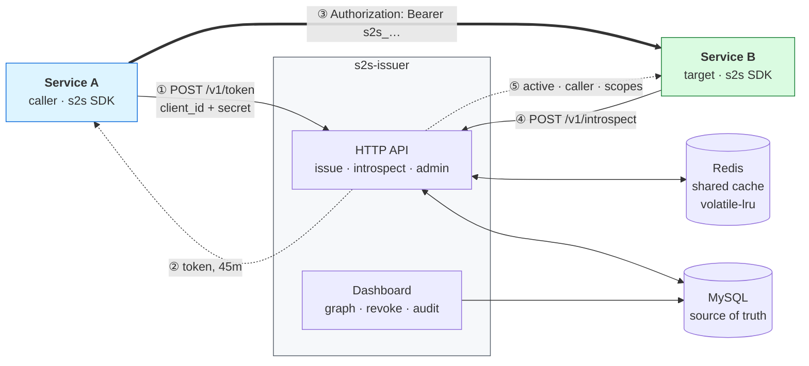

# Rotating Service-to-Service Token Issuer

**Internal services authenticate to each other with short-lived tokens that
rotate themselves — replacing per-pair shared secrets that nobody dares rotate.**

Go · Gin · MySQL · Redis · Cobra · zap

---

## The problem

The usual way to do service-to-service auth is to put `SECRET_XYZ` in Service A
and the same `SECRET_XYZ` in Service B. That breaks down:

- **N² secrets.** Every calling pair needs its own. Twenty services is hundreds.
- **Rotation is a coordinated deploy.** Both sides must change at the same
  instant. In practice A rolls, B hasn't, and production starts returning 401.
- **So nobody rotates.** Secrets live for years — exactly when a leak in a log,
  a git history, or a Slack message becomes a breach.
- **No visibility.** Nobody can answer "which services can call this one?"

This service sits between every pair. A holds one credential for the *issuer*,
never one for B. Rotation stops being a deploy, and revocation becomes a button.

|  | shared secret | this |
|---|---|---|
| secrets to manage | one per pair (N²) | one per service (N) |
| rotation | coordinated deploy | automatic, no restart |
| revocation | redeploy both sides | one click, ~15 ms |
| blast radius of a leak | until someone notices | ≤ one token lifetime |
| "who calls whom?" | grep every repo | a live graph |

---

## Architecture



A and B share **nothing**. Each authenticates only to the issuer; the token is
the only thing crossing between them, and it rotates itself.

---

## Quickstart

```bash
make up        # MySQL + Redis via docker compose
make migrate   # apply the schema
make run       # start the issuer on :8080 (ops on :9090)
```

Then register two services and let them talk:

```bash
make demo      # two real services calling each other through the issuer
```

`make demo` walks the whole lifecycle — issuance, scope denial, force-rotate
recovery mid-flight, and revocation. See [`examples/`](examples/).

For the dashboard, create an operator and open <http://localhost:8080>:

```bash
echo 'your-password-here' | ./bin/s2s user create you@example.com "Your Name" --role admin
```

---

## Design decisions

### Overlapping rotation

A grant stores two numbers: `lifetime` (45m) and `rotate_after` (15m). Clients
fetch a new token at 15m; the old one stays valid until 45m. **The 30-minute
overlap is just the difference between them** — no `grace_until` column, no
state machine, no way for the two to disagree.

This is why rotation never drops a request. Pods still holding the previous
token keep working until their own refresh timers fire.

`superseded_at` and `revoked_at` are deliberately different columns: a
superseded token still works, a revoked one does not.

### One current token per grant, enforced by the database

Tokens are issued **per grant, not per pod**. Every pod of a service shares one
`client_id`, so per-pod tokens would add no revocation granularity anyone could
act on — you cannot tell which pod leaked — while fragmenting cache locality.

The invariant is a MySQL 8 generated column rather than lock discipline:

```sql
current_grant_id BIGINT UNSIGNED GENERATED ALWAYS AS
    (IF(superseded_at IS NULL AND revoked_at IS NULL, grant_id, NULL)) VIRTUAL,
UNIQUE KEY uk_tokens_current (current_grant_id)
```

NULLs do not collide in a unique index, so every superseded or revoked row drops
out of the constraint automatically. Thirty concurrent issuance requests for one
grant produce exactly one token.

### Validation cache TTL is 0 on the client

The SDK's `ValidationCacheTTL` defaults to **0** — the target service caches
nothing. That is what makes revocation genuinely instant: there is no local copy
for the issuer to fail to invalidate. Whatever you set it to is exactly how
stale your revoke button becomes.

Caching lives on the issuer instead, in one shared Redis. Because it is shared
rather than per-replica, `DEL` is the complete invalidation story and hit rate
is independent of replica count — no pub/sub protocol, no convergence window.

Revocation writes a **tombstone** rather than deleting, and the read path
repopulates with `SET NX`, so a reader whose MySQL lookup was in flight when a
revocation committed cannot resurrect the token. See
[`test/integration_test.go`](test/integration_test.go).

### The `realm="s2s"` marker on 401s

When the validator rejects a token it sets:

```
WWW-Authenticate: Bearer realm="s2s", error="invalid_token"
```

The caller's SDK keys on that marker to decide whether to refresh and retry. It
matters because a **401 from the target's own application logic must not trigger
a token refresh** — without the marker, every app-level 401 would cause a
pointless round trip to the issuer.

This is what makes force-rotate self-healing: an operator kills a live token,
the next call 401s, the SDK refreshes and replays, and nothing is redeployed.

### Opaque tokens, not JWTs

A signed JWT verified locally is faster, but cannot be revoked before it
expires. Instant revocation is the feature this exists to provide, so the
introspection hop stays. The cost is that the issuer sits on the critical path
of every internal call — which is why the caching tiers and their failure
behaviour get the attention they do.

---

## Known limitations

Documented rather than hidden. These are real and not yet fixed.

**Plaintext tokens live in Redis.** MySQL stores only a SHA-256 hash, but
`grant:cur:<id>` holds the plaintext so that every pod of a caller receives the
same token. Anyone who can read Redis can impersonate any caller until those
keys expire. Mitigations in place: Redis is internal-only with no persistence
(`--save ""`), and keys expire at `rotate_after`. Not yet done: AUTH/TLS on
Redis, or deriving the plaintext from a keyed HMAC so it need not be stored.

**Rotating a service's secret does not revoke its tokens.**
`POST /v1/services/:id/rotate-secret` stops the service obtaining *new* tokens
and invalidates its cached credential verification immediately, but tokens
already issued keep working until they expire. If you rotate a secret because it
leaked, revoke or force-rotate the affected grants too. The fix is to reuse the
same invalidation path `SetStatus` now uses.

**No delete for services or grants.** You can disable a service and revoke a
grant, but neither row can be removed, and `uk_grants_pair` means a revoked
grant can never be recreated for that pair. A mistaken revocation currently has
no recovery path.

**Credential spraying is not rate limited.** `ClientCredentials` runs *before*
the rate limiter, which keys on the authenticated caller. An attacker sending
invalid credentials pays argon2 on every attempt without being throttled — and
at 64 MiB per concurrent verification that is a memory-exhaustion vector. Needs
a pre-auth, IP-keyed limiter before this faces an untrusted network.

**Load-test numbers are preliminary.** The figures below are single-client,
warm, local Docker — one client, no concurrency, no sustained load. They
indicate the shape of the hot path, not its behaviour under traffic. A proper
load test (steady state, hot-key, cold cache, Redis down, replica scale-out) is
still outstanding.

| | measured |
|---|---|
| introspect p50 / p95 / p99 | 1.71 / 2.92 / 3.48 ms |
| revoke → first rejection | 3.98 ms |
| wrong client secret | 193 ms (argon2, intentional) |

---

## Layout

| path | |
|---|---|
| `cmd/` | Cobra entry points — `serve`, `migrate`, `user` |
| `pkg/` | issuer: `constants`, `structs`, `service`, `repository`, `controller`, `middleware` |
| `sdk/` | **separate Go module** — client library, one dependency |
| `examples/` | two real services plus `demo.sh` |
| `test/` | integration tests against real MySQL and Redis |
| `web/` | dashboard templates and assets, embedded via `go:embed` |

---

## Using the SDK

```go
// caller
client, _ := s2s.New(s2s.Config{IssuerURL: ..., ClientID: ..., ClientSecret: ...})
billing := client.For("billing-api")             // an ordinary *http.Client
resp, _ := billing.Get("http://billing-api.internal/invoices/42")

// target
v, _ := s2s.NewValidator(cfg)
mux.Handle("/invoices", v.RequireScope("billing:read")(handler))
caller, _ := s2s.CallerFrom(r.Context())         // "orders-api", verified
```

Full documentation in [`sdk/README.md`](sdk/README.md), including the
`client.Token()` path for gRPC and message queues.

---

## Tests

```bash
make test                     # unit + SDK, with -race
make up && make test-integration   # adds the MySQL/Redis suite
```

